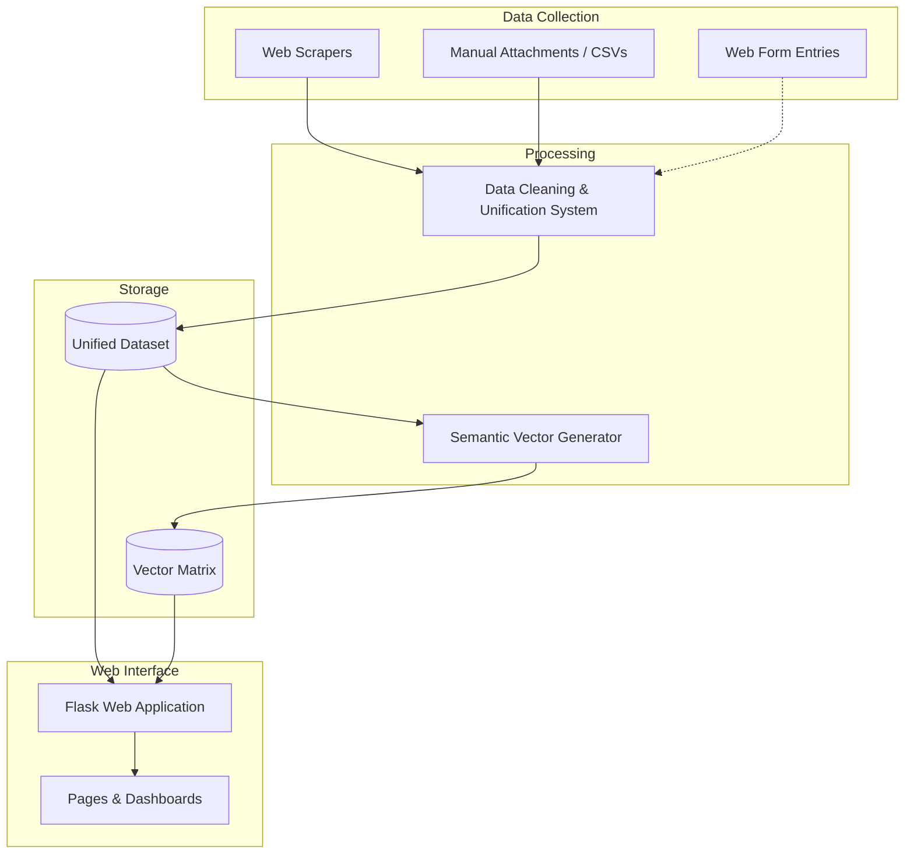

# Job Data Observatory

## Motivation
This project was created as an extension project of IMPA-Tech. The primary goal is to provide a comprehensive analysis of the job market in the data field. To serve this analysis, we collect data from diverse websites using manual data gathering and automated web scrapers when possible. This raw data then passes through a cleaning and standardization system—which we are currently working to fully automate—before being served to the end user through a purpose-built graphical web interface.

## Getting Started

```bash
python -m venv .venv
source .venv/bin/activate          # Windows: .venv\Scripts\activate
pip install -r requirements.txt

# 1) Merge every available source in data/ and data_preprocess/ into data/vagas_unificadas.csv
python -m data_treatment.merge_data_sources

# 2) Generate sentence embeddings for semantic search (data/embeddings.npy)
python -m data_treatment.generate_embeddings

# 3) Precompute the dashboard's charts (job_obs/static/images/dashboard_context.json)
python -m job_obs.service.dashboard_data

# 4) Run the web app
python -m job_obs.app   # http://127.0.0.1:5005
```

Steps 1–3 only need to be re-run when the underlying data changes; the Flask app just reads their output. By default the app runs without Werkzeug's debug/reloader (safe for a quick local check); set `FLASK_DEBUG=1` in your environment if you're actively editing the code and want auto-reload + the interactive debugger — just don't do that on a machine reachable from outside your network, since the debugger allows arbitrary code execution.

## System Architecture



## Project Components Explanation

### 1. Data Ingestion
Data is gathered from five sources, all merged by `data_treatment/merge_data_sources.py`:
- **Web Scrapers (`job_scrapper/update_data.py`)**: An automated Selenium script iterates through search URLs defined in `job_scrapper/.config/links_linkedin.txt`. It pulls live job postings from LinkedIn, capturing the company name, raw position, location, and the full HTML description, and saves the output to `data/linkedin_data_raw.json`. This file is a generated artifact (gitignored) — on a fresh checkout it won't exist yet, and the merge pipeline simply skips this source with a warning until you run the scraper yourself. Note: LinkedIn scraping requires a real logged-in browser session (see the script's docstring) and should only be run in line with LinkedIn's own terms of service.
- **`data/raw_data.csv`**: manually compiled "Salário Transparente" data (497 records), already in the unified column format.
- **`data_preprocess/catho.csv`**: job postings manually scraped from Catho. Parsed defensively (regex-guarded salary/region extraction) because the source has known column-alignment issues (e.g. the `empresa` column is unusable — see code comments in `load_and_process_catho_data`).
- **`data_preprocess/glassdoor.csv`**: ~4.7k aggregated salary benchmarks per company/role from Glassdoor (min/max/average), not individual job postings. Kept 1:1 (not expanded by report count) so they contribute real salary data without inflating job-count statistics; a handful of implausible monthly values (six figures) are treated as missing rather than skewing the charts.
- **`data_preprocess/cientista_de_dados.csv`**: manually collected postings from Gupy-based company career pages.
- **Web Form Entries (`/vaga/nova`)**: Individual job postings can be inserted via a web form in the Flask app. These entries are logged directly into an isolated JSON file (`data/vagas_added_BY_users.json`). Note: as part of our ongoing struggle to fully automate the pipeline, these manual web entries are currently saved but not yet automatically merged into the main unification system.

### 2. Data Cleaning & Unification (`data_treatment/`)
Because data comes from disparate sources with varying formats, it passes through a multi-step Python pipeline to standardize it.
- **Per-source loaders (`merge_data_sources.py`)**: one loader per source above, each mapping to the same unified schema (`role`, `company`, `seniority`, `region`, `work_model`, `salary`, ...). `role` and `seniority` are classified through the same regex vocabulary (`ROLE_REGEX` / `SENIORITY_REGEX`, shared from `linkedin_data_pipeline.py`) regardless of source, so e.g. "Analista de Dados Sênior" (raw_data.csv) and a Glassdoor "Data Analyst" entry both end up as `data_analyst` instead of fragmenting role-based charts into dozens of literal titles.
- **Scraped Data Processing (`linkedin_data_pipeline.py`)**: The `LinkedInDataPipeline` class loads the scraped `linkedin_data_raw.json`. It normalizes raw text and uses extensive Regular Expression (Regex) dictionaries to scan job descriptions and automatically categorize `role`, `seniority`, `work_model`, and `region`. It further uses regex to extract structured fields like `technologies`, `benefits`, `salary`, and `contract_type`.
- **Merger & Binarization**: `run_merge_pipeline` loads every available source (skipping any that are missing on disk instead of crashing), concatenates them, and scans the unified `benefits` column to create binarized boolean columns (e.g., `benefit_plano_de_saude: yes/no`) for easier dashboard rendering, outputting the final clean dataset to `data/vagas_unificadas.csv`.

> **Data quality note**: coverage varies a lot by field. Salary is populated for ~97% of records (thanks to the Glassdoor benchmarks), but region/work model/benefits are only populated for the ~10% of records that come from sources that report them (raw_data.csv, Catho, Gupy). Every dashboard chart shows a "records used" annotation so you always know the sample size behind it — see the "Panorama do Mercado de Dados no Brasil (2026)" analysis in the gallery for a full breakdown.

### 3. Semantic Vectorization (`data_treatment/generate_embeddings.py`)
To support intelligent search functionality, the text from each job is converted into mathematical vectors.
- **Text Preparation**: The script reads `data/vagas_unificadas.csv` and builds an optimized, concatenated text string for each job by joining the `role`, `seniority`, `region`, `work_model`, `technologies`, `benefits`, and a truncated version of the full description (limited to 500 characters).
- **Encoding & Storage**: These composite strings are passed through a multilingual text encoding algorithm in batches. The algorithm maps the contextual meaning of the text into high-dimensional vectors, which are then saved locally as a NumPy array (`data/embeddings.npy`).
- **Search Execution (`job_obs/app.py`)**: During a search query (`/api/search`), the web server encodes the user's input into a vector and calculates the cosine similarity against the `embeddings.npy` matrix. This empowers the system to rank and return job opportunities based on deep conceptual similarity rather than relying on exact keyword matches.

### 4. Web Interface & Pages
We built a graphical web interface to serve our analyses to the public. Here is an explanation of each page on the site:
- **Home (`/`)**: The landing page of the application, welcoming users to the observatory.
- **Dashboard (`/dashboard`)**: A visual analytics page featuring interactive charts, statistics, and geographic distributions of data science jobs across the market.
- **Semantic Search**: An interface (powered by the `/api/search` endpoint) where users can describe what they are looking for, and the system surfaces the most relevant opportunities based on vector similarity.
- **Analysis Gallery (`/analisys_html`)**: A dedicated space where project participants can publish and read detailed market analysis articles (see instructions below).
- **Add New Job (`/vaga/nova`)**: A form allowing anyone to manually insert a new job posting directly into our database.

---

## How to Create a Data Analysis Page

A core feature of this project is allowing participants to create and publish their own data analysis pages within the **Analysis Gallery**. 

To publish a new analysis, follow these exact steps:

1. **Create a Markdown File**
   Create a new `.md` (or `.html` containing markdown) file inside the `analisys_html/` folder. The base name of this file will become the "slug" for your article. 
   *Example: If you name it `minha_analise.md`, your slug is `minha_analise`.*

2. **Add YAML Metadata**
   Your file MUST begin with a YAML metadata block enclosed by `---`. This provides the necessary information for the gallery to display your article correctly.
   ```yaml
   ---
   title: "Your Analysis Title"
   author: "Your Name"
   date: "2024-03-25"
   summary: "A brief summary of what this analysis covers."
   image_capa: "cover_image.jpg"
   ---
   ```

3. **Add the Cover Image**
   If you specified an `image_capa` in the YAML block, you must place that image file in a very specific directory structure.
   Inside the `analisys_secondary_files/` folder, create a folder named after your slug, and inside that, a folder named `images`. Place your image there.
   *Following the example above, you would place `cover_image.jpg` exactly here:*
   `analisys_secondary_files/minha_analise/images/cover_image.jpg`

4. **Write Your Content**
   Below the closing `---` of the YAML block, write your analysis using standard Markdown. You can include tables and code blocks. When a user visits your page, the web application will automatically parse the Markdown and render it beautifully in HTML.

## License

This project is licensed under the [MIT License](LICENSE).
